<p align="center">
	
</p>
<h1 align="center" style="margin: 30px 0 30px; font-weight: bold;">CPS返利代理管理系统</h1>
<h4 align="center">基于 SpringBoot + Vue + 微信小程序的多平台CPS返利代理系统</h4>
<p align="center">
	
	
	
	
	
</p>

---

## 项目简介

本项目是一个完整的 **CPS（按销售付费）返利代理管理系统**，涵盖微信小程序端和管理后台端。系统通过整合多个电商联盟平台（淘宝客、京东联盟、拼多多、大淘客、好单库），为代理提供商品推广、佣金返利、团队管理等核心能力，帮助代理实现自购省钱、推广赚钱。

### 核心价值

- **多平台聚合** — 一个小程序接入淘宝、京东、拼多多等多个电商联盟，统一商品搜索与推广
- **代理返利体系** — 自购返佣 + 推广赚佣，支持多级代理邀请和佣金分配
- **统一管理后台** — 代理审核、联盟账号分配、佣金计算与结算，一站式管理
- **开箱即用** — 基于 RuoYi-Vue 框架，内置完整的权限管理与系统监控

---

## 系统架构

```
┌──────────────────────────────────────────────────────────────────┐
│                        微信小程序 (tbk-miniapp)                    │
│  首页 │ 商品搜索 │ 商品详情 │ 代理申请 │ 个人中心 │ 分享推广       │
└──────────────────────────┬───────────────────────────────────────┘
                           │ HTTP API
                           ▼
┌──────────────────────────────────────────────────────────────────┐
│                    后端服务 (Spring Boot)                          │
│  ┌──────────────┐  ┌──────────────┐  ┌──────────────────────┐   │
│  │ 小程序API接口  │  │ 管理后台接口   │  │ 联盟SDK调试接口       │   │
│  │ /miniapp/*   │  │ /system/*    │  │ /union/*             │   │
│  └──────┬───────┘  └──────┬───────┘  └──────────┬───────────┘   │
│         │                 │                      │               │
│  ┌──────┴─────────────────┴──────────────────────┴───────────┐   │
│  │                    业务服务层 (Service)                     │   │
│  │  代理管理 │ 佣金计算 │ 订单管理 │ 联盟账号 │ 微信用户       │   │
│  └──────────────────────────┬───────────────────────────────┘   │
│                             │                                   │
│  ┌──────────────────────────┴───────────────────────────────┐   │
│  │              联盟SDK模块 (ruoyi-union-sdk)                │   │
│  │  淘宝客 │ 京东联盟 │ 拼多多 │ 大淘客 │ 好单库 │ AI模块    │   │
│  └──────────────────────────────────────────────────────────┘   │
└──────────────────────────┬───────────────────────────────────────┘
                           │
                           ▼
┌──────────────────────────────────────────────────────────────────┐
│              管理后台 (Vue + Element UI)                           │
│  代理审核 │ 联盟账号管理 │ 佣金管理 │ 订单管理 │ SDK调试          │
└──────────────────────────────────────────────────────────────────┘
```

---

## 技术栈

| 层级 | 技术 | 说明 |
|------|------|------|
| **小程序端** | 微信小程序原生开发 | 适配器模式支持多平台，统一数据格式 |
| **前端后台** | Vue 2 + Element UI | 基于 RuoYi-Vue 前端框架 |
| **后端** | Spring Boot 2.x + Spring Security + Redis + Jwt | 基于 RuoYi-Vue 后端框架 |
| **联盟SDK** | 自研 ruoyi-union-sdk | 封装淘宝客/京东/拼多多/大淘客/好单库 API |
| **数据库** | MySQL | 业务表 + 系统表 |
| **缓存** | Redis | Token缓存、数据缓存 |

---

## 业务功能

### 一、微信小程序端

#### 1. 首页 - 多平台商品大厅

支持在淘宝客、京东联盟、拼多多等平台间自由切换，展示轮播图、商品分类、热门商品列表。支持关键词搜索商品，一键生成推广口令（淘口令/京口令/拼多多链接）。

| 功能 | 说明 |
|------|------|
| 多平台切换 | 下拉选择不同联盟平台，动态加载对应商品 |
| 商品搜索 | 支持关键词搜索，分页加载更多 |
| 分类浏览 | 按女装、男装、美妆、数码等分类浏览 |
| 推广口令生成 | 一键生成淘口令/京口令/推广链接，复制分享 |

#### 2. 商品详情页

展示商品完整信息，包括价格、优惠券、佣金比例、月销量等，支持生成推广口令和分享。

#### 3. 代理申请

用户填写真实姓名、手机号、微信号，选择要开通的联盟平台类型，提交代理申请，等待管理员审核。

#### 4. 个人中心

| 功能 | 说明 |
|------|------|
| 佣金统计 | 展示累计佣金、可提现佣金、今日佣金等 |
| 代理信息 | 展示邀请码、代理级别、绑定平台等 |
| 我的团队 | 查看下级代理列表（代理专属） |
| 提现管理 | 申请佣金提现（代理专属） |
| 分享推广 | 生成专属推广链接分享给好友 |

#### 5. 微信一键登录

使用 `wx.login` 获取 code，后端换取 openid 完成登录，无需额外授权。

### 二、管理后台端

#### 1. 代理申请管理

审核代理申请，分配联盟平台账号。支持按姓名、电话、邀请码、状态筛选。

| 操作 | 说明 |
|------|------|
| 审核通过/拒绝 | 审核代理申请信息 |
| 分配联盟账号 | 为代理分配对应平台的 AppKey/AppSecret/AdzoneId |
| 取消联盟分配 | 解除代理与联盟账号的绑定 |
| PDD授权备案 | 为拼多多联盟进行授权备案 |

#### 2. 联盟信息管理

管理各联盟平台的账号配置，包括 AppKey、AppSecret、SiteId、AdzoneId、AccessToken 等。支持按平台类型查询可用联盟账号，查看账号引用状态。

| 平台 | 配置项 | 状态 |
|------|--------|------|
| 淘宝客 (TBK) | AppKey, AppSecret, AdzoneId | ✅ 已完成 |
| 京东联盟 (JD) | AppKey, AppSecret, SiteId, PositionId | ✅ 已完成 |
| 拼多多 (PDD) | ClientId, ClientSecret, Pid | ✅ 已完成 |
| 大淘客 (DTK) | AppKey, AppSecret | ✅ 已完成 |
| 好单库 (HDK) | ApiKey | ✅ 已完成 |

#### 3. 佣金管理

| 模块 | 说明 |
|------|------|
| 订单佣金 | 查看所有订单佣金记录，支持按订单号/平台/状态筛选，支持结算和退款操作 |
| 代理佣金账户 | 查看各代理的累计收益、余额、冻结金额等 |
| 佣金配置 | 配置全局佣金比例（自购比例、推广比例） |
| 佣金流水 | 查看所有佣金变动记录（收入/提现/退款） |

#### 4. 联盟SDK调试

提供淘宝客商品搜索、店铺搜索、物料列表、推广列表等调试页面，方便开发测试。

### 三、核心业务流程

```
┌────────────────────────────────────────────────────────────────┐
│                    代理注册与审核流程                             │
│  小程序登录 → 填写申请信息 → 管理员审核 → 分配联盟账号 → 开始推广  │
└────────────────────────────────────────────────────────────────┘

┌────────────────────────────────────────────────────────────────┐
│                    商品推广与佣金流程                             │
│  搜索商品 → 生成推广口令 → 分享给好友 → 好友下单 → 产生佣金       │
│       │                                              │         │
│       │         ┌────────────────────────────────────┘         │
│       │         ▼                                              │
│       │    佣金分配：自购40% + 推广5% + 平台55%                  │
│       │         │                                              │
│       │         ▼                                              │
│       │    订单结算 → 佣金入账 → 代理提现                        │
└────────────────────────────────────────────────────────────────┘

┌────────────────────────────────────────────────────────────────┐
│                    代理层级体系                                  │
│  上级代理 ──邀请码──→ 下级代理                                   │
│     │                    │                                     │
│     │ 自购返佣 40%       │ 自购返佣 40%                          │
│     │ 推广返佣 5%        │ 推广佣金归上级                        │
│     └────────────────────┘                                     │
└────────────────────────────────────────────────────────────────┘
```

---

## 演示图

### 小程序端

<table>
    <tr>
        <td align="center">小程序首页</td>
        <td align="center">平台切换</td>
    </tr>
    <tr>
        <td>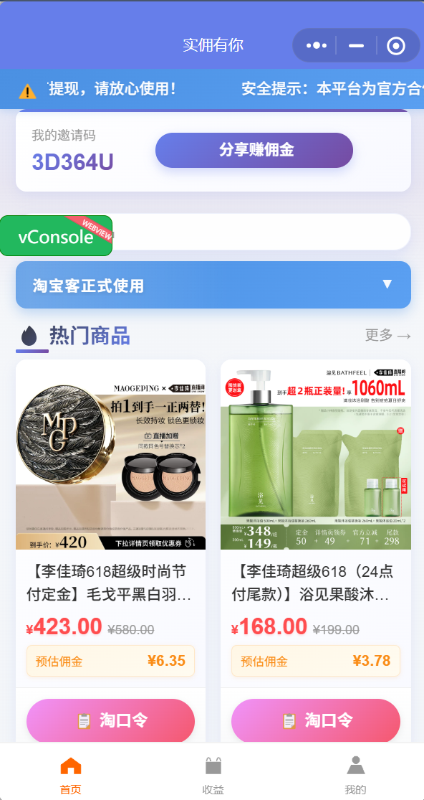</td>
        <td>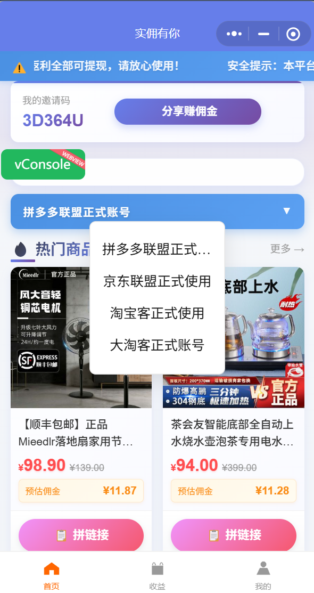</td>
    </tr>
    <tr>
        <td align="center">微信一键登录</td>
        <td align="center">个人中心</td>
    </tr>
    <tr>
        <td>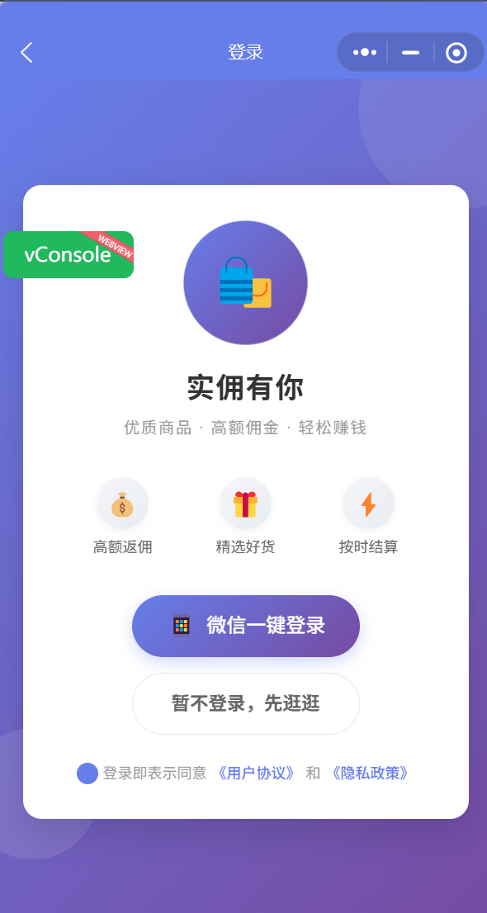</td>
        <td>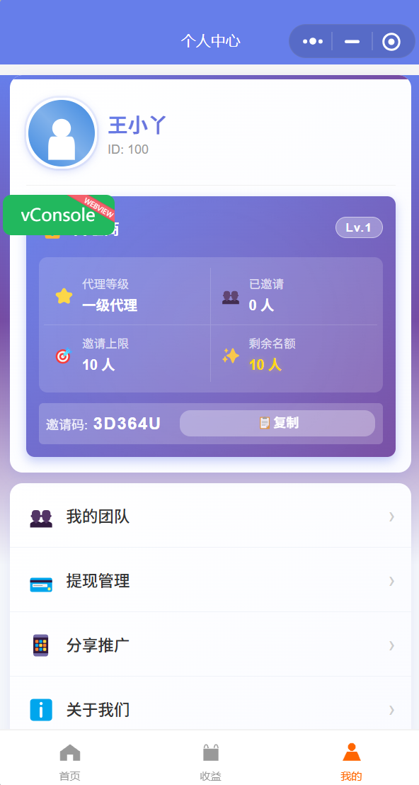</td>
    </tr>
    <tr>
        <td align="center">商品详情页</td>
        <td align="center">分享链接</td>
    </tr>
    <tr>
        <td>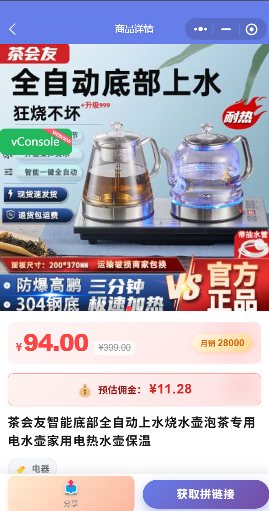</td>
        <td>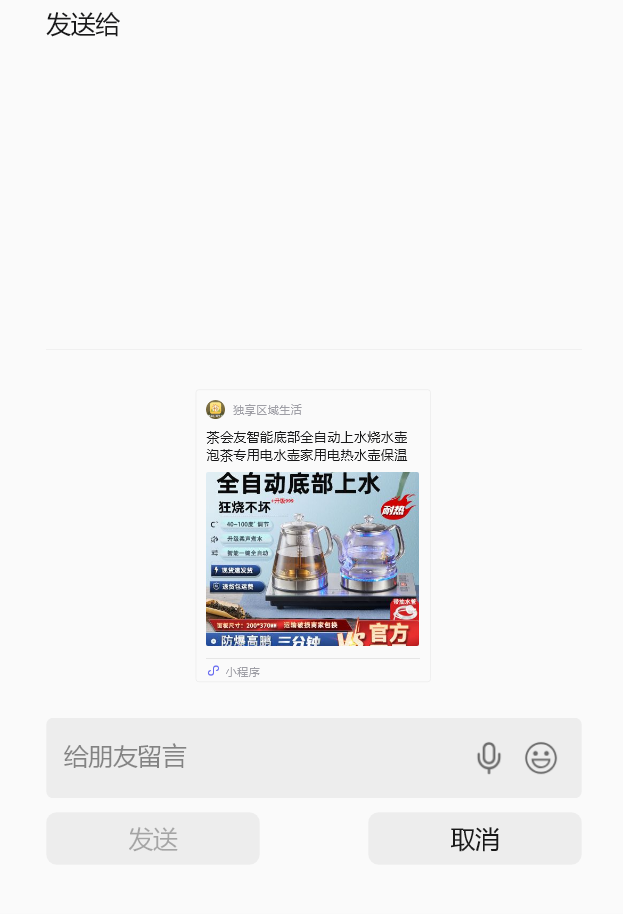</td>
    </tr>
    <tr>
        <td align="center">推广链接</td>
        <td></td>
    </tr>
    <tr>
        <td>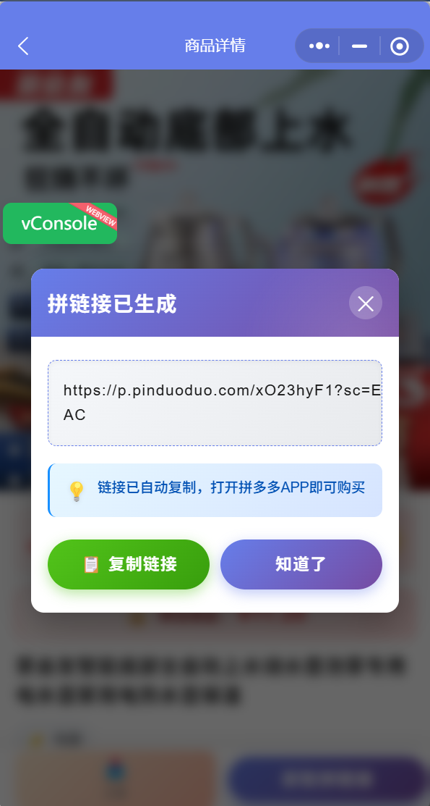</td>
        <td></td>
    </tr>
</table>

### 管理后台端

<table>
    <tr>
        <td align="center">后台首页</td>
        <td align="center">代理申请管理</td>
    </tr>
    <tr>
        <td>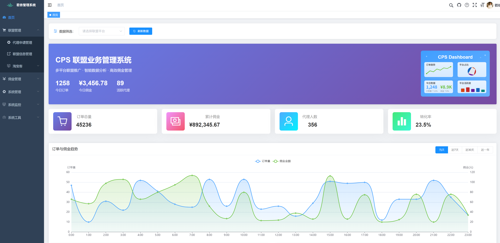</td>
        <td>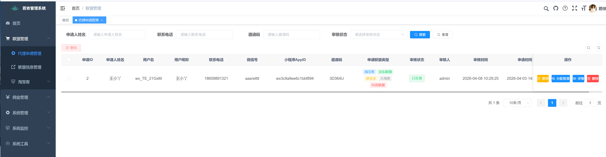</td>
    </tr>
    <tr>
        <td align="center">联盟信息管理</td>
        <td align="center">淘客商品列表</td>
    </tr>
    <tr>
        <td>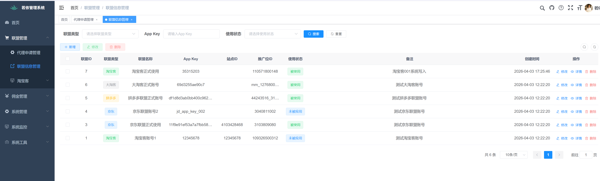</td>
        <td>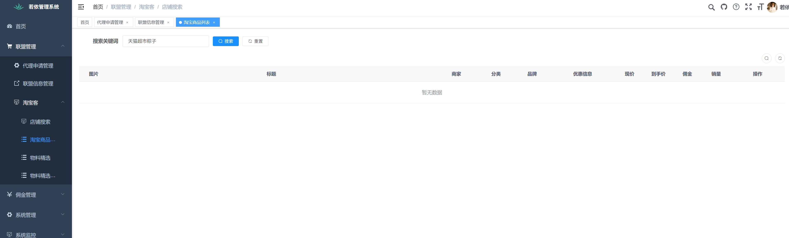</td>
    </tr>
    <tr>
        <td align="center">代理联盟分配</td>
        <td align="center">代理信息详情</td>
    </tr>
    <tr>
        <td>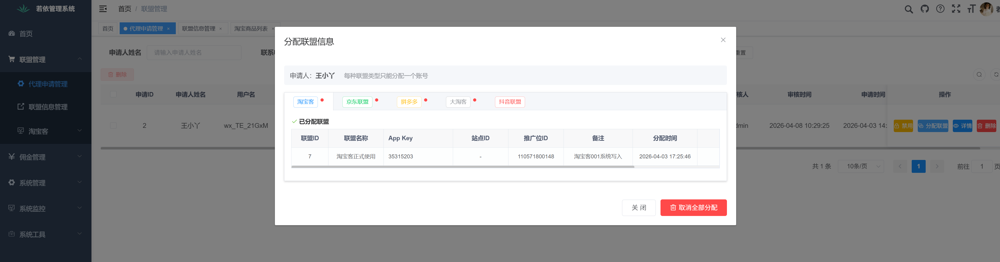</td>
        <td>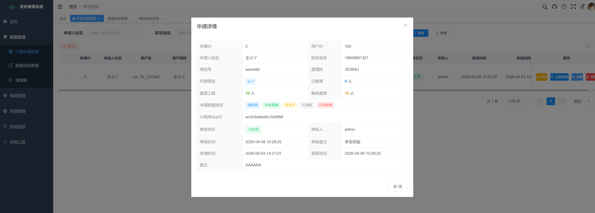</td>
    </tr>
</table>

---

## 小程序多平台架构

小程序采用 **适配器模式** 实现多平台统一接入：

```
┌─────────────────────────────────────────────────────────┐
│                      小程序页面层                          │
│              (pages/goods/list, detail...)               │
└────────────────────┬────────────────────────────────────┘
                     ▼
┌─────────────────────────────────────────────────────────┐
│                 统一API调用层 (api/platform-api.js)        │
│  getGoodsList() · getGoodsDetail() · getHotGoods()      │
│  generateCode() · getTpwd() · getCategoryList()          │
└────────────────────┬────────────────────────────────────┘
                     ▼
┌─────────────────────────────────────────────────────────┐
│              适配器工厂 (utils/tbk-adapter.js)             │
└──────┬─────────┬──────────┬──────────┬─────────────────┘
       ▼         ▼          ▼          ▼
  ┌─────────┐ ┌─────────┐ ┌─────────┐ ┌─────────┐
  │淘宝客    │ │京东联盟  │ │多多进宝  │ │大淘客    │
  │适配器 ✅ │ │适配器 ✅ │ │适配器 🔜 │ │适配器 ✅ │
  └─────────┘ └─────────┘ └─────────┘ └─────────┘
```

所有平台商品数据统一转换为标准格式，前端无需关心底层平台差异。

---

## 项目结构

```
RuoYi-Vue/
├── ruoyi-admin/              # 后端启动模块
│   └── controller/
│       ├── miniapp/          # 小程序API接口
│       │   ├── MiniappAuthController        # 微信登录认证
│       │   ├── MiniappTbkController         # 淘宝客接口
│       │   ├── MiniappJdController          # 京东联盟接口
│       │   ├── MiniappPddController         # 拼多多接口
│       │   ├── MiniappDtkController         # 大淘客接口
│       │   ├── MiniappHdkController         # 好单库接口
│       │   ├── MiniAppCommissionController  # 佣金查询
│       │   └── MiniappUserController        # 用户管理
│       ├── system/          # 管理后台接口
│       │   ├── SysTbkAgentApplyController           # 代理申请管理
│       │   ├── SysUnionPlatformController           # 联盟信息管理
│       │   ├── SysOrderCommissionController         # 订单佣金管理
│       │   ├── SysAgentCommissionAccountController  # 佣金账户管理
│       │   ├── SysCommissionConfigController        # 佣金配置
│       │   └── SysCommissionFlowController          # 佣金流水
│       └── union/           # 联盟SDK调试
│           └── TbkController                       # 淘宝客调试
├── ruoyi-system/             # 系统业务模块
│   └── service/             # 业务服务
│       ├── ICommissionCalculateService   # 核心佣金计算服务
│       ├── ISysTbkAgentApplyService      # 代理申请服务
│       ├── ISysAgentUnionRelationService  # 代理联盟关联服务
│       ├── ISysUnionPlatformService      # 联盟平台服务
│       ├── ITbkSdkService / IJdSdkService / IPddApiService  # SDK服务
│       └── ...
├── ruoyi-union-sdk/         # 联盟SDK模块（自研）
│   └── module/
│       ├── TbkModule        # 淘宝客SDK
│       ├── JdModule         # 京东联盟SDK
│       ├── PddModule        # 拼多多SDK
│       ├── DtkModule        # 大淘客SDK
│       ├── HdkModule        # 好单库SDK
│       └── GiteeAiModule    # AI模块
├── ruoyi-ui/                # Vue前端后台
│   └── views/
│       ├── system/
│       │   ├── tbkApply/           # 代理申请管理页
│       │   ├── unionPlatform/      # 联盟账号管理页
│       │   └── commission/         # 佣金管理
│       │       ├── order/          # 订单佣金页
│       │       ├── account/        # 佣金账户页
│       │       ├── config/         # 佣金配置页
│       │       └── flow/           # 佣金流水页
│       └── union/
│           └── tbk/               # 淘宝客SDK调试页
├── tbk-miniapp/             # 微信小程序
│   ├── pages/
│   │   ├── index/           # 首页
│   │   ├── goods/           # 商品列表 & 详情
│   │   ├── agent/           # 代理申请
│   │   ├── user/            # 个人中心
│   │   ├── auth/            # 登录
│   │   └── share/           # 分享推广
│   ├── adapters/            # 多平台适配器
│   │   ├── base-adapter.js  # 适配器基类
│   │   ├── tbk-adapter.js   # 淘宝客适配器 ✅
│   │   ├── jd-adapter.js    # 京东联盟适配器 ✅
│   │   ├── pdd-adapter.js   # 拼多多适配器 🔜
│   │   ├── dtk-adapter.js   # 大淘客适配器 ✅
│   │   └── hdk-adapter.js   # 好单库适配器 ✅
│   ├── api/                 # 统一API封装
│   ├── config/              # 平台配置
│   └── utils/               # 工具类
├── ruoyi-common/            # 公共模块
├── ruoyi-framework/         # 框架模块
├── ruoyi-generator/         # 代码生成
├── ruoyi-quartz/            # 定时任务
└── sql/                     # 数据库脚本
```

---

## 数据库设计（核心业务表）

| 表名 | 说明 |
|------|------|
| `sys_tbk_agent_apply` | 代理申请表 — 姓名、手机、微信、邀请码、代理级别、申请平台类型、状态 |
| `sys_union_platform` | 联盟信息表 — 平台类型、AppKey、AppSecret、SiteId、AdzoneId、引用状态 |
| `sys_agent_union_relation` | 代理联盟关联表 — 代理与联盟账号的绑定关系、授权状态 |
| `sys_order_commission` | 订单佣金记录表 — 订单号、佣金金额、自购佣金、推广佣金、订单状态 |
| `sys_agent_commission_account` | 代理佣金账户表 — 累计收益、余额、冻结金额 |
| `sys_agent_commission_config` | 代理佣金配置表 — 按代理级别配置自购/推广佣金比例 |
| `sys_commission_flow` | 佣金流水表 — 收入/提现/退款流水记录 |
| `sys_wechat_user` | 微信用户关联表 — openid、unionid、昵称、头像 |

---

## 快速开始

### 环境要求

- JDK 1.8+
- MySQL 5.7+ / 8.0
- Redis 3.0+
- Node.js 12+
- 微信开发者工具

### 后端部署

```bash
# 1. 导入数据库
mysql -u root -p ry-vue < sql/ry_20xxxxxx.sql
mysql -u root -p ry-vue < sql/cps-20xxxxxx.sql

# 2. 修改配置
# 编辑 ruoyi-admin/src/main/resources/application-druid.yml
# 修改数据库连接信息
# 编辑 ruoyi-admin/src/main/resources/application.yml
# 修改 Redis 连接信息和联盟平台配置

# 3. 编译运行
mvn clean package -DskipTests
java -jar ruoyi-admin/target/ruoyi-admin.jar
```

### 前端部署

```bash
cd ruoyi-ui
npm install
npm run dev
```

### 小程序部署

1. 使用微信开发者工具打开 `tbk-miniapp` 目录
2. 修改 `app.js` 中的 `apiUrl` 为后端地址
3. 修改 `project.config.json` 中的 `appid`
4. 在微信公众平台配置服务器域名
5. 编译运行

### 联盟平台配置

在后端配置文件 `application.yml` 中配置各联盟平台参数：

```yaml
# 淘宝客
union:
  tbk:
    app-key: your-app-key
    app-secret: your-app-secret
    adzone-id: your-adzone-id

# 京东联盟
  jd:
    app-key: your-app-key
    app-secret: your-app-secret

# 拼多多
  pdd:
    client-id: your-client-id
    client-secret: your-client-secret
```

---

## 内置功能（RuoYi框架）

1. 用户管理：用户是系统操作者，该功能主要完成系统用户配置。
2. 部门管理：配置系统组织机构（公司、部门、小组），树结构展现支持数据权限。
3. 岗位管理：配置系统用户所属担任职务。
4. 菜单管理：配置系统菜单，操作权限，按钮权限标识等。
5. 角色管理：角色菜单权限分配、设置角色按机构进行数据范围权限划分。
6. 字典管理：对系统中经常使用的一些较为固定的数据进行维护。
7. 参数管理：对系统动态配置常用参数。
8. 通知公告：系统通知公告信息发布维护。
9. 操作日志：系统正常操作日志记录和查询；系统异常信息日志记录和查询。
10. 登录日志：系统登录日志记录查询包含登录异常。
11. 在线用户：当前系统中活跃用户状态监控。
12. 定时任务：在线（添加、修改、删除)任务调度包含执行结果日志。
13. 代码生成：前后端代码的生成（java、html、xml、sql）支持CRUD下载。
14. 系统接口：根据业务代码自动生成相关的api接口文档。
15. 服务监控：监视当前系统CPU、内存、磁盘、堆栈等相关信息。
16. 缓存监控：对系统的缓存信息查询，命令统计等。
17. 在线构建器：拖动表单元素生成相应的HTML代码。
18. 连接池监视：监视当前系统数据库连接池状态，可进行分析SQL找出系统性能瓶颈。

---

## 开源协议

本项目基于 [MIT License](LICENSE) 协议开源，可供个人及企业免费使用。

---

## 捐赠

如果这个项目对你有帮助，欢迎请作者喝杯咖啡 ☕

| 链类型 | 地址 |
|--------|------|
| **Ethereum (ETH)** | `0x2CfBca7DBb0eef8ced407b69C54981fa3348a9Ff` |
| **Solana (SOL)** | `9tMTcoFRTSCGmhVnsuHCmrguKcCjHyfacm4NbBTcuJ1C` |
| **BNB Chain (BNB)** | `0x2CfBca7DBb0eef8ced407b69C54981fa3348a9Ff` |

---

## 致谢

- [RuoYi-Vue](https://gitee.com/y_project/RuoYi-Vue) — 基于SpringBoot+Vue前后端分离的Java快速开发框架
- [淘宝客SDK](https://open.taobao.com/) — 淘宝开放平台
- [京东联盟SDK](https://union.jd.com/) — 京东联盟开放平台
- [拼多多SDK](https://open.pinduoduo.com/) — 拼多多开放平台
